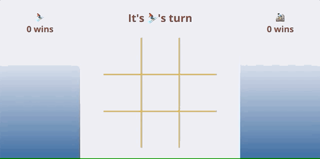

# Colorado Tic Tac Toe
My final solo project after 6 weeks at Turing: build a tic tac toe game from scratch! Choose to be a `skiier` or a `biker`. If you win, you get to have a great day in the mountains. If you lose, it means you got stuck on I-70 :cry:.

# Goals
- Use problem solving processes to break down large problems, solve things step by step, and trust yourself to not rely on an outside “answer” to a logical challenge
- Understand the difference between the data model and how the data is displayed on the DOM
- Iterate through/filter DOM elements using for loops

**Solidify and demonstrate understanding of:**
  * DRY JavaScript
  * Local storage to persist data
  * Event delegation to handle similar event listeners  

## Contributors
Myself, and the occasional pick-me-up from my lovely mentor, [@farmermel](https://github.com/farmermel).

## Technologies
- Javascript
- JSON
- HTML
- CSS
- GitHub
- Git
- Atom

## Code Architecture
Since one of the goals of this project relied on building a strong data model, I created the following:
- A `player.js` file that contains a `Player` class and is the source of truth for everything happening to the 2 players
- A `game.js` file that contains a `Game` class and is the source of truth for everything happening in the game
- A `main.js` file that contains all DOM-related Javascript

Before ever touching `main.js`, I tried to make the game fully playable without the DOM to force myself to think data-model first.

## Features

### Start a New Game
Upon opening `index.html`, the game starts out with an empty gameboard. Each player has 0 wins, and `skiier` goes first.

### How to Win
In case you somehow don't know how to play tic tac toe by now, you can win by getting 3 in a row, 3 in a column, or 3 diagonally. When a player wins, their win count in the sidebar increases. This will persist on page refresh, so if you want to take a break, you can come back to the game without losing your precious win count.

A game can also end with a tie.

### How to Play Again
When a game ends, the gameboard automatically refreshes after 3 seconds so you can play another game. The next game starts out with the player who lost going first.

## Wins
- As a fresh Mod 1 Turing student, this was a daunting task for me! I spent a good amount of time planning out my approach to this project before writing any code. It was all pretty stressful until I got the functionality working. But once it worked, I had a lot more confidence in myself. It's amazing to look back and see how much I've learned in just 6 weeks.

## Challenges
- The spec sheet we were given had a gradient both in the sidebars _and_ within the borders of the gameboard. Building the sidebar gradients was easy, but I had a hard time figuring out the border gradient.
- I had a harder time than expected getting the gameboard sizing to be both fixed height/width AND responsive.

## Future Features
- Add a starting screen where you can choose your own player token (emoji)
- Make design responsive across small, medium, and large breakpoints
- It would be fun to add some animations to this project
